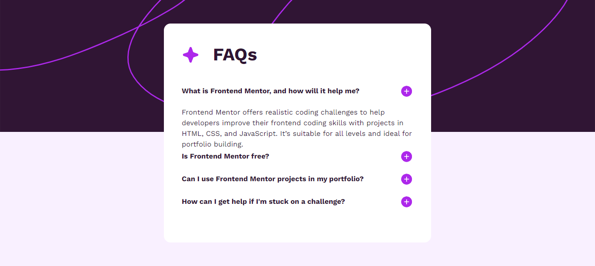

# pablodev - FAQ accordion solution

### Main note of coder (in portuguese)

**Olá galera, estou escrevendo essa nota para ser sincero com vocês! de fato 70% dessa solução foi trazido de outro lugar, isso é chatgpt, documentação ou outras soluções também, sei que isso tudo é processo e que este é o mais dificil até então, mas vai dar tudo certo! tem que dar.**


This is a solution to the [FAQ accordion challenge on Frontend Mentor](https://www.frontendmentor.io/challenges/faq-accordion-wyfFdeBwBz). Frontend Mentor challenges help you improve your coding skills by building realistic projects. 


### Screenshot




### Links

- Solution URL: [Add solution URL here](https://your-solution-url.com)
- Live Site URL: [Add live site URL here](https://your-live-site-url.com)

## My process

### What I learned

Little by little I'm adapting to JavaScript, it's difficult but I'm already starting to get familiar with the scripts and I think there's not much left, the key is consistency


My code in Js have just little lins, so its here:

```JavaScript
document.addEventListener("DOMContentLoaded", function() {
    const buttons = document.querySelectorAll(".toggle-button");

    buttons.forEach(button => {
        button.addEventListener("click", function() {
            const answer = this.parentElement.nextElementSibling;
            answer.classList.toggle("show");
            
            if (answer.classList.contains("show")) {
                this.src = "assets/images/icon-minus.svg";
            } else {
                this.src = "assets/images/icon-plus.svg";
            }
        });
    });
});
```

### Continued development

As always, I intend to continue studying and learning JavaScript, I know that eventually the text in this section will change lol


## pablodev

- Website - [pablodev site](https://www.pabloteixeira.site)
- Frontend Mentor - [@pabloodev](https://www.frontendmentor.io/profile/pabloodev)

